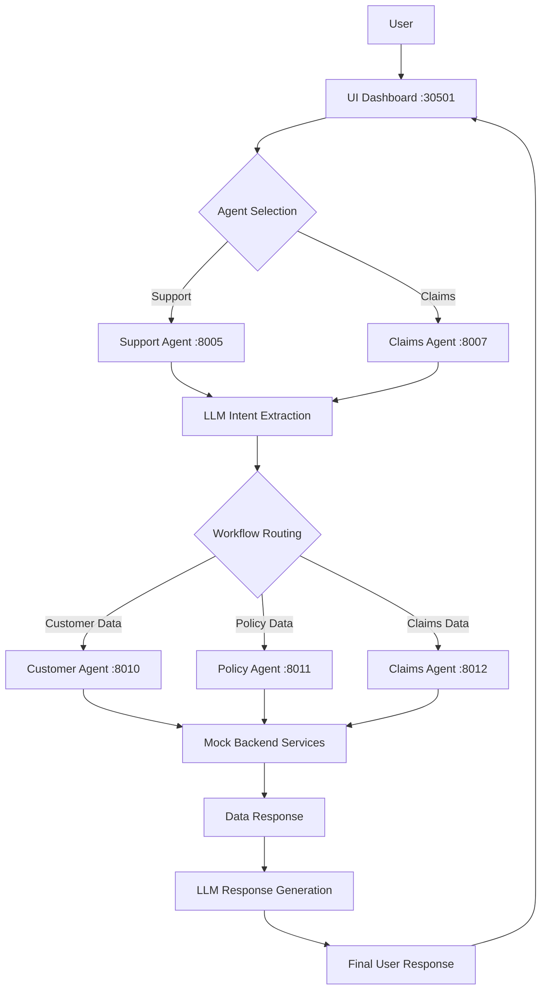

# 🏥 Insurance AI PoC - Complete Deployment Summary

## 🎯 What We've Built

A comprehensive, production-ready Insurance AI proof-of-concept featuring:

### 🎭 Interactive UI Dashboard
- **Real-time Streamlit interface** for PoC demonstration and monitoring
- **Multi-agent chat interface** with dropdown selection between Support and Claims agents
- **Live LLM thinking process visualization** - watch AI analyze and respond step-by-step
- **Agent activity monitoring** - see all backend agent communications in real-time
- **API call visualization** - monitor HTTP requests/responses between services
- **Health status indicators** - real-time agent availability and metrics

### 🤖 Multi-Agent Architecture
- **Support Domain Agent**: Customer inquiries, policy status, billing questions
- **Claims Domain Agent**: Claim filing, status checks, claims support
- **Technical Agents**: Customer data, policy data, claims data operations
- **LLM Integration**: OpenRouter API with primary/fallback model support

### 🔐 Security-First Approach
- **No hardcoded secrets** - all API keys from environment variables
- **Template-based deployment** - secure variable substitution with `envsubst`
- **Interactive setup script** - guides secure configuration
- **Git-ignored credentials** - `.env` file never committed
- **Kubernetes secrets** - secure cluster-based secret management

## 🚀 Quick Start (Complete Workflow)

### 1. Secure Environment Setup
```bash
# Interactive setup (recommended)
./scripts/setup_env.sh

# This will:
# - Create .env file from template
# - Prompt for OpenRouter API key
# - Save securely to git-ignored .env file
```

### 2. Deploy Everything
```bash
# Single command deployment
./scripts/deploy_k8s.sh

# This will:
# - Load API key from .env file
# - Build Docker images (agents + UI)
# - Deploy to Kubernetes with proper secrets
# - Wait for all services to be ready
```

### 3. Access Interactive Dashboard
```bash
# Open main interface
open http://localhost:30501

# Key features:
# 🎯 Agent selection dropdown
# 💬 Real-time chat interface
# 🧠 LLM thinking process visualization
# 🔍 Agent activity monitoring
# 📡 API call visualization
# 📊 Health status and metrics
```

## 🌐 Access Points

| Service | URL | Purpose |
|---------|-----|---------|
| **📊 UI Dashboard** | http://localhost:30501 | **Primary interface - start here** |
| 🏥 Support Agent API | http://localhost:30005 | Direct API access |
| 📋 Claims Agent API | http://localhost:30008 | Direct API access |

## 🎭 Dashboard Capabilities

### 💬 Multi-Agent Chat Interface
- **Agent Selection**: Switch between Support and Claims agents via dropdown
- **Customer Context**: Optional customer ID for personalized responses
- **Quick Test Scenarios**: Pre-built test messages for each agent type
- **Conversation History**: Last 5 interactions with full context

### 🧠 LLM Thinking Process (Real-time)
- **Processing Steps**: Watch AI analyze user input step-by-step
- **Intent Recognition**: See how agents extract user intent
- **Workflow Detection**: Monitor when specific workflows are identified
- **API Preparation**: See when agents prepare to call backend services
- **Response Generation**: Watch final response creation
- **Error Tracking**: Visualize any processing errors

### 🔍 Agent Activity Monitor
- **Skill Execution**: Track when agent skills are invoked
- **Parameter Inspection**: View input parameters and processing details
- **Success/Failure States**: Visual indicators for all operations
- **Response Analysis**: Inspect full agent responses
- **Timing Information**: Precise timestamps for all activities

### 📡 API Call Visualization
- **HTTP Request Tracking**: Monitor all backend communications
- **Request/Response Inspection**: Full payload and response visibility
- **Status Code Monitoring**: Visual success/failure indicators
- **Real-time Updates**: Live view of inter-service communication

### 📊 System Health & Metrics
- **Agent Status**: Real-time health indicators
- **Activity Metrics**: Count and frequency of operations
- **Workflow Patterns**: Analysis of interaction types
- **Communication Flow**: Visual diagrams of agent interactions

## 🧪 Testing Scenarios

### Through Dashboard (Recommended)
1. **Support Agent Tests**:
   - "I want to check my auto insurance policy status"
   - "How do I update my contact information?"
   - "When is my next premium payment due?"

2. **Claims Agent Tests**:
   - "I was in a car accident yesterday and need to file a claim"
   - "What's the status of my claim #12345?"
   - "What documents do I need for a home insurance claim?"

### Through Command Line
```bash
# Test LLM integration
python scripts/test_llm_integration.py smoke

# Test in Kubernetes cluster
kubectl exec -it deployment/support-agent -n insurance-poc -- \
  python scripts/test_llm_integration.py integration
```

## 🔐 Security Features Implemented

### ✅ Environment Variable Management
- API keys loaded from `.env` file or environment
- Template-based Kubernetes secret creation
- No hardcoded credentials anywhere in codebase

### ✅ Secure Deployment Process
```bash
# API key validation during deployment
if [ -z "$OPENROUTER_API_KEY" ]; then
    echo "❌ Error: API key required"
    exit 1
fi

# Secure secret creation
envsubst < k8s/manifests/secrets.yaml | kubectl apply -f -
```

### ✅ Best Practices
- Git-ignored `.env` files
- Interactive setup script for guidance
- Kubernetes secrets for cluster deployment
- Environment variable substitution
- No credentials in container images

## 🏗️ Architecture Flow



## 📊 Deployment Status

### ✅ Completed Components
- [x] Multi-agent architecture with LLM integration
- [x] Interactive Streamlit UI dashboard
- [x] Real-time monitoring and visualization
- [x] Secure environment variable management
- [x] Complete Kubernetes deployment
- [x] Comprehensive test suite
- [x] Documentation and guides

### 🎯 Key Achievements
- **Security-first approach** with no hardcoded secrets
- **Real-time visualization** of LLM thinking process
- **Multi-agent communication** monitoring
- **Production-ready deployment** with health checks
- **Interactive demonstration** capability

## 🔄 Monitoring & Health

### Health Check URLs
```bash
# UI Dashboard
curl http://localhost:30501/_stcore/health

# Support Agent
curl http://localhost:30005/health

# Claims Agent
curl http://localhost:30008/health
```

### Log Monitoring
```bash
# UI Dashboard logs
kubectl logs -f deployment/ui-dashboard -n insurance-poc

# Agent logs
kubectl logs -f deployment/support-agent -n insurance-poc
kubectl logs -f deployment/claims-agent -n insurance-poc
```

### Resource Usage
- **UI Dashboard**: 256Mi-1Gi memory, 200m-1000m CPU
- **Domain Agents**: 256Mi-1Gi memory, 200m-1000m CPU  
- **Technical Agents**: 128Mi-512Mi memory, 100m-500m CPU

## 🎯 Demo Flow for Stakeholders

### 1. Show Real-time Agent Communication
1. Open http://localhost:30501
2. Select "Support Domain Agent"
3. Enter test message: "I want to check my policy status"
4. **Watch the magic happen**:
   - LLM Thinking tab shows AI processing steps
   - Agent Activity tab shows skill execution
   - API Calls tab shows backend communication

### 2. Demonstrate Multi-Agent Capability
1. Switch to "Claims Domain Agent"
2. Test message: "I need to file a claim for car accident"
3. Show how different agents handle different domains
4. Display real-time workflow detection

### 3. Show Error Handling & Resilience
1. Try invalid requests to show error handling
2. Show fallback model usage
3. Demonstrate health monitoring

## 📝 Next Steps

### Production Enhancements
- [ ] Add persistent storage for conversation history
- [ ] Implement user authentication and sessions
- [ ] Add more sophisticated monitoring and alerting
- [ ] Create CI/CD pipeline for automated deployments
- [ ] Add rate limiting and request throttling

### Feature Extensions
- [ ] Voice interface integration
- [ ] Mobile-responsive UI
- [ ] Advanced analytics dashboard
- [ ] Integration with actual insurance systems
- [ ] Multi-language support

## 🎉 Summary

We've successfully created a **comprehensive, production-ready Insurance AI PoC** that demonstrates:

1. **🔐 Security-first architecture** with proper secret management
2. **🎭 Interactive real-time dashboard** for stakeholder demonstrations
3. **🤖 Multi-agent LLM integration** with thinking process visualization
4. **📊 Complete monitoring** of agent activities and API communications
5. **🚀 One-command deployment** to Kubernetes with all services

The solution provides both **technical depth** for developers and **visual appeal** for business stakeholders, making it perfect for PoC demonstrations and further development.

**Primary Access Point**: http://localhost:30501 📊 