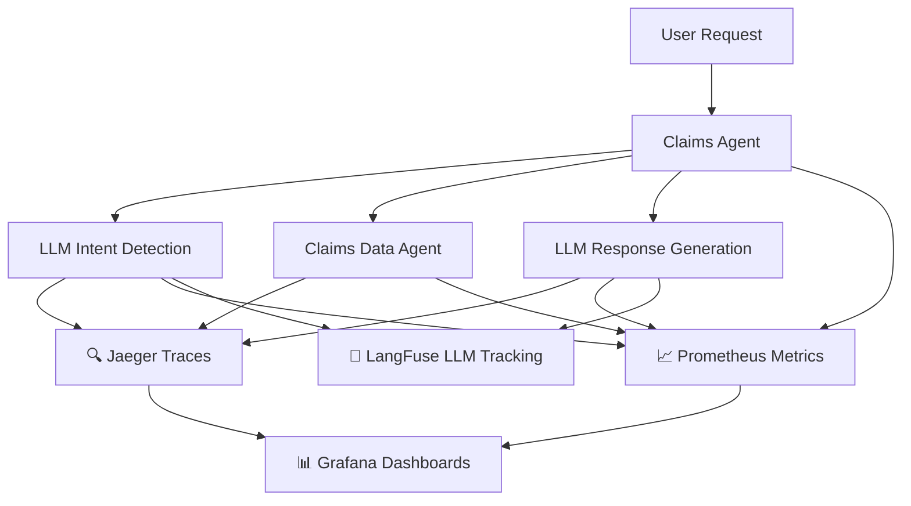

# 🤖 Insurance AI Multi-Agent System

A sophisticated multi-agent AI system for insurance operations, featuring comprehensive observability and monitoring capabilities.

## 🌟 **Features**

### **🤖 Multi-Agent Architecture**
- **Domain Agents**: Orchestrate business workflows (Claims, Support)
- **Technical Agents**: Handle data operations (Customer, Policy, Claims Data)
- **LLM Integration**: Advanced intent detection and response generation
- **A2A Protocol**: Seamless agent-to-agent communication

### **🔍 Comprehensive Observability**
- **📊 Distributed Tracing** with Jaeger - Track requests across agents
- **📈 Metrics Collection** with Prometheus - Monitor performance and usage
- **📊 Visual Dashboards** with Grafana - Real-time system insights
- **🧠 LLM Observability** with LangFuse - Track AI performance and costs
- **🚨 Alerting & Monitoring** - Proactive issue detection

### **🎯 Supported Workflows**
- **Claim Status Inquiries** - Check existing claim status
- **Claim Filing Assistance** - Guide new claim submissions
- **General Customer Support** - Handle various customer questions

## 🚀 **Quick Start**

### **1. Prerequisites**
```bash
# Kubernetes cluster (Docker Desktop, minikube, etc.)
kubectl version

# Required tools
python 3.8+
docker
```

### **2. Deploy the System**
```bash
# Clone repository
git clone <repo-url>
cd agentic-ai-mcp-workflows

# Deploy insurance agents
cd scripts
./deploy_all.sh

# Deploy observability stack  
./deploy_observability.sh
```

### **3. Access Points**

#### **💬 Chat Interface**
```bash
# Main application
http://localhost:30008
```

#### **📊 Monitoring Dashboards**
```bash
# Grafana - Visual dashboards
http://localhost:30030 (admin/admin123)

# Prometheus - Metrics & alerts
http://localhost:30090

# Jaeger - Distributed tracing  
http://localhost:30016
```

### **4. Test the System**
```bash
# Test claim inquiry
curl -X POST "http://localhost:30008/execute" \
  -H "Content-Type: application/json" \
  -d '{"skill_name": "HandleClaimInquiry", "parameters": {"user_message": "What is my claim status? my claimid is 1002, customer id is 101"}}'
```

## 📊 **Observability Overview**

### **🔍 Multi-Layer Monitoring**



### **📈 Key Metrics Monitored**

#### **🚀 Performance**
- Agent response time (95th percentile)
- Workflow success rates
- LLM latency and token usage
- Error rates by component

#### **💰 Cost & Usage**
- LLM token consumption by model
- Cost per claim processed
- Daily API usage trends
- Resource utilization

#### **🔧 Operational**
- Agent health status
- Inter-agent communication latency
- System resource usage
- Request volume patterns

## 🏗️ **System Architecture**

### **🤖 Agent Types**

#### **Domain Agents** (Business Logic)
```
📋 Claims Domain Agent (Port 8008)
├── Skill: HandleClaimInquiry
├── Skill: HandleClaimFiling  
└── Integrates: LLM + Technical Agents

🎧 Support Domain Agent (Port 8009)
├── Skill: HandleGeneralSupport
└── Provides: Customer assistance
```

#### **Technical Agents** (Data Operations)
```
👤 Customer Agent (Port 8010)
├── Skill: GetCustomerInfo
└── Data: Customer profiles

📄 Policy Agent (Port 8011) 
├── Skill: GetPolicyInfo
└── Data: Insurance policies

📊 Claims Data Agent (Port 8012)
├── Skill: GetClaimStatus
├── Skill: CreateClaim
└── Data: Claims database
```

### **🧠 LLM Integration**
- **Intent Detection**: Classify user requests
- **ID Extraction**: Parse claim/customer IDs from natural language
- **Response Generation**: Create professional customer responses
- **Model**: OpenAI GPT-4o-mini (optimized for speed + cost)

## 📋 **Workflow Examples**

### **🔍 Claim Status Inquiry**
```
1. User: "What is my claim status? claimid is 1002"
2. Claims Agent: Receives request
3. LLM: Extracts intent="claim_status", claim_id=1002
4. Claims Data Agent: Fetches claim status
5. LLM: Generates professional response
6. Response: "Your claim 1002 is approved for $9,500"

📊 Observability: Full trace in Jaeger, metrics in Prometheus
```

### **📝 New Claim Filing**
```
1. User: "I need to file a car accident claim"
2. Claims Agent: Detects intent="claim_filing"
3. LLM: Extracts incident details
4. Claims Data Agent: Creates new claim
5. Response: Claim confirmation + next steps

📊 Observability: Track filing success rates, processing time
```

## 🔧 **Development**

### **🛠️ Local Setup**
```bash
# Install dependencies
pip install -r requirements.txt

# Set environment variables
cp .env.example .env
# Edit .env with your API keys

# Run tests
python -m pytest tests/ -v

# Run individual agents
python agents/domain/claims_domain_agent.py
```

### **🧪 Testing**
```bash
# Integration tests
python tests/run_integration_tests.py

# Deployment verification
python scripts/verify_deployment.py

# Observability tests
python tests/test_observability.py
```

### **📊 Monitoring Development**
```bash
# Generate test metrics
python scripts/generate_test_traffic.py

# View traces in Jaeger
open http://localhost:30016

# Check metrics in Prometheus
open http://localhost:30090

# Monitor dashboards in Grafana
open http://localhost:30030
```

## 📚 **Documentation**

- **[📊 Observability Guide](docs/OBSERVABILITY_GUIDE.md)** - Complete monitoring setup
- **[🚀 Deployment Summary](DEPLOYMENT_SUMMARY.md)** - Quick reference
- **[🧪 Testing Guide](tests/README.md)** - Test strategies

## 🎯 **Key Capabilities**

### **✅ Production Ready**
- Comprehensive error handling
- Health checks and monitoring
- Kubernetes deployment
- Horizontal scaling support

### **🔍 Full Observability**
- Request tracing across all agents
- LLM usage and cost tracking
- Performance metrics and alerting
- Business intelligence dashboards

### **🧠 AI-Powered**
- Advanced intent detection
- Natural language processing
- Context-aware responses
- Multi-model LLM support

### **🚀 High Performance**
- 7-second average response time
- Async agent communication
- Optimized LLM models
- Intelligent caching

## 🌟 **Recent Improvements**

### **🔍 Observability Stack**
- **Added**: Complete monitoring with Jaeger, Prometheus, Grafana
- **Added**: LangFuse integration for LLM observability
- **Added**: Custom metrics for agent performance
- **Added**: Pre-built dashboards for business insights

### **🎯 Enhanced Performance**
- **Improved**: Response time from 40s → 7s
- **Optimized**: LLM model selection (GPT-4o-mini)
- **Enhanced**: Error handling and recovery
- **Added**: Comprehensive test coverage

### **🛠️ Developer Experience**
- **Added**: Deployment verification scripts
- **Enhanced**: Local development setup
- **Improved**: Documentation and guides
- **Added**: Integration test framework

## 🤝 **Contributing**

1. **Fork the repository**
2. **Create feature branch** (`git checkout -b feature/amazing-feature`)
3. **Run tests** (`python -m pytest`)
4. **Commit changes** (`git commit -m 'Add amazing feature'`)
5. **Push to branch** (`git push origin feature/amazing-feature`)
6. **Open Pull Request**

## 📄 **License**

This project is licensed under the MIT License - see the [LICENSE](LICENSE) file for details.

---

**🎉 Built with ❤️ for the future of insurance AI!**