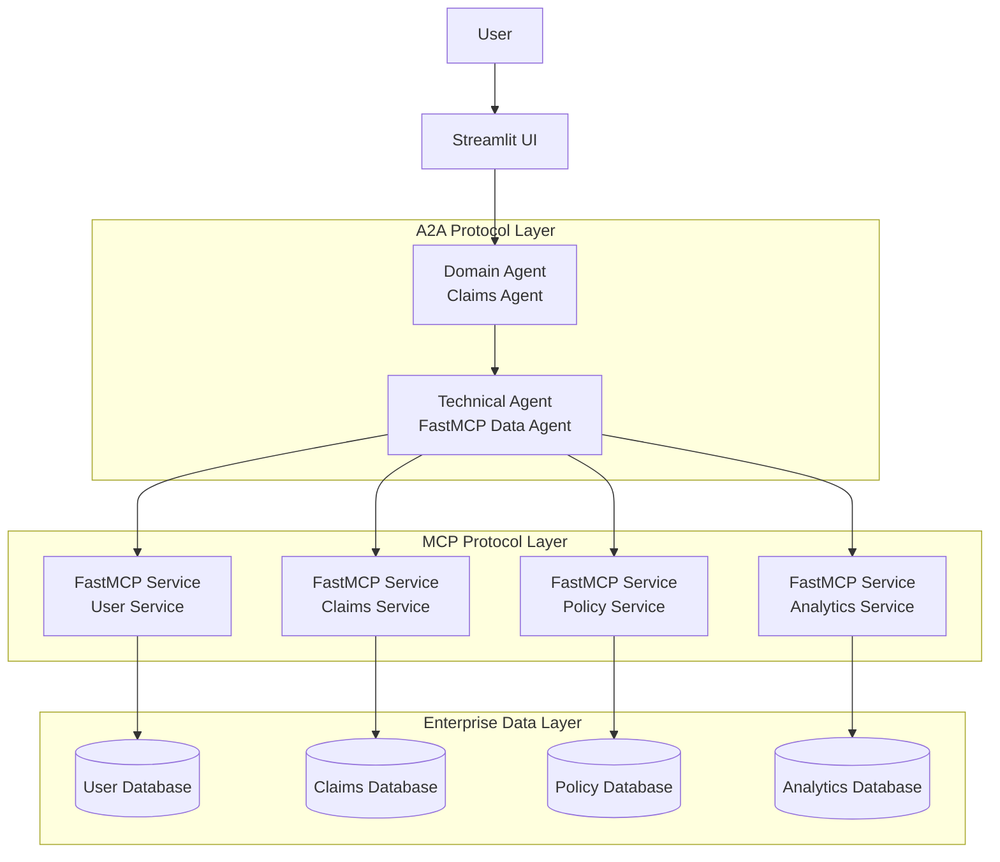
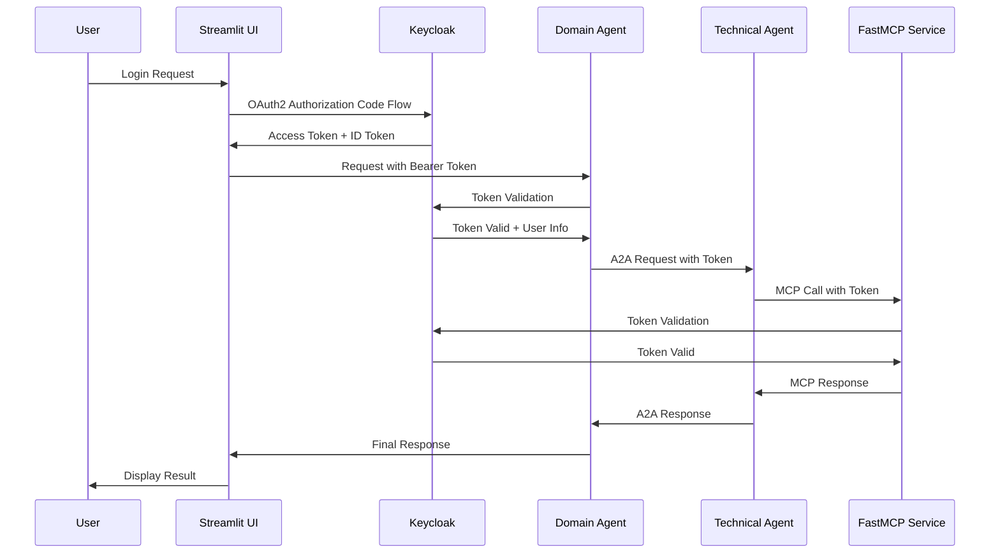
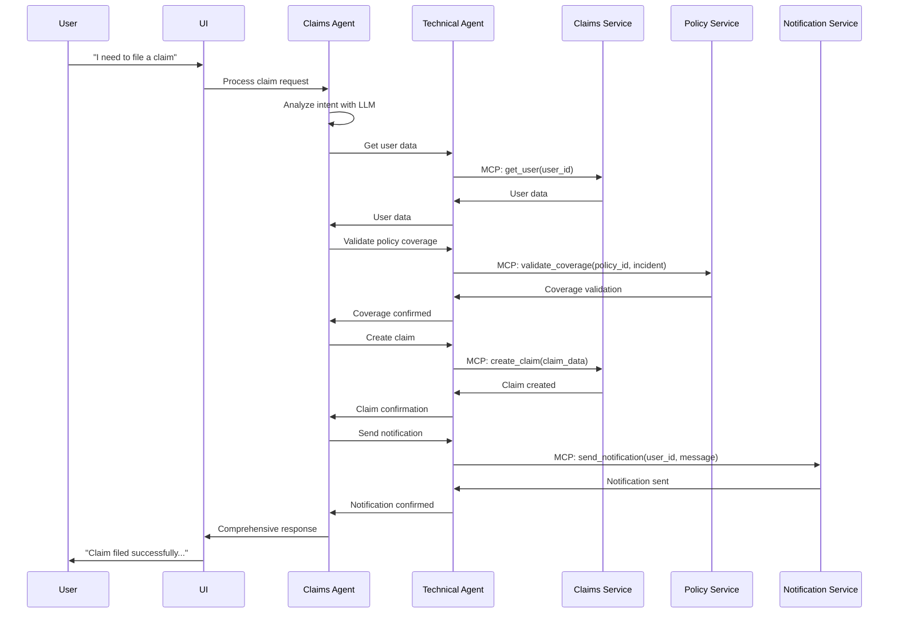

# Insurance AI PoC - System Architecture

## 🏗️ Overview

This document details the architecture of our Kubernetes-native Insurance AI Proof-of-Concept system. The architecture combines **Anthropic's Model Context Protocol (MCP)** for enterprise tool access with **Google's Agent-to-Agent (A2A)** protocol for intelligent orchestration.

## 🎯 Design Principles

### 1. Separation of Concerns
- **FastMCP Services**: Handle enterprise data and business logic
- **A2A Domain Agents**: Orchestrate complex business workflows  
- **Technical Agents**: Bridge different protocols and systems
- **UI Layer**: Provide intuitive user experience

### 2. Protocol-Driven Communication
- **MCP**: Standardized AI tool access and data retrieval
- **A2A**: Secure agent-to-agent task delegation and orchestration
- **REST**: Human-readable API access for development/debugging

### 3. Kubernetes-Native Design
- **Microservices**: Independent, scalable service deployment
- **Container Orchestration**: Resilient, self-healing infrastructure
- **Cloud-Ready**: Production deployment patterns

## 🔄 System Flow



## 📦 Component Architecture

### FastMCP Services Layer

**Purpose**: Expose enterprise APIs and data as MCP tools for AI agents

#### User Service (`services/user_service/`)
```python
# MCP Tools Exposed:
- get_user(user_id: str) -> UserData
- authenticate_user(email: str, password: str) -> AuthResult  
- list_users(filters: Optional[Dict]) -> List[UserData]
- create_user(user_data: UserCreationRequest) -> UserData
- update_user(user_id: str, updates: UserUpdateRequest) -> UserData
```

**Capabilities**:
- User authentication and session management
- User profile CRUD operations
- OAuth2 token validation
- Dual-mode operation (FastMCP/FastAPI)

#### Claims Service (`services/claims_service/`)
```python
# MCP Tools Exposed:
- get_claim(claim_id: str) -> ClaimData
- create_claim(claim_data: ClaimCreationRequest) -> ClaimData
- list_claims(customer_id: str) -> List[ClaimData]
- update_claim_status(claim_id: str, status: str) -> ClaimData
- calculate_claim_estimate(claim_details: Dict) -> EstimateResult
```

**Capabilities**:
- Claims lifecycle management
- Fraud detection integration
- Damage assessment algorithms
- Document processing

#### Policy Service (`services/policy_service/`)
```python
# MCP Tools Exposed:
- get_policy(policy_id: str) -> PolicyData
- calculate_quote(quote_request: QuoteRequest) -> QuoteResult
- list_policies(customer_id: str) -> List[PolicyData]
- update_policy(policy_id: str, changes: PolicyChanges) -> PolicyData
- validate_coverage(policy_id: str, incident: Dict) -> CoverageResult
```

**Capabilities**:
- Policy management and administration
- Premium calculation algorithms
- Coverage validation logic
- Risk assessment integration

#### Analytics Service (`services/analytics_service/`)
```python
# MCP Tools Exposed:
- generate_report(report_type: str, parameters: Dict) -> ReportData
- get_customer_metrics(customer_id: str) -> CustomerMetrics
- get_business_metrics(time_period: str) -> BusinessMetrics
- calculate_risk_score(customer_data: Dict) -> RiskScore
```

**Capabilities**:
- Business intelligence and reporting
- Customer behavior analysis
- Risk modeling and scoring
- Performance metrics calculation

### A2A Domain Agents Layer

**Purpose**: Implement business logic and orchestrate complex workflows using LLM reasoning

#### Claims Agent (`agents/domain/claims_agent.py`)

**Core Responsibilities**:
- Analyze customer requests using LLM reasoning
- Orchestrate multi-step claims processes
- Make intelligent decisions about claim approval/denial
- Coordinate with technical agents for data access

**Example Workflow**:
```python
async def process_claim_request(self, user_request: str) -> Dict[str, Any]:
    # 1. Parse user intent using LLM
    intent = await self.analyze_intent(user_request)
    
    # 2. Gather necessary data via Technical Agent
    if intent.requires_authentication:
        auth_result = await self.call_agent("technical_auth", {
            "action": "verify_user",
            "user_id": intent.user_id
        })
    
    # 3. Retrieve relevant data via A2A calls
    claim_data = await self.call_agent("technical_data", {
        "tool": "get_claim",
        "params": {"claim_id": intent.claim_id}
    })
    
    policy_data = await self.call_agent("technical_data", {
        "tool": "get_policy", 
        "params": {"policy_id": claim_data.policy_id}
    })
    
    # 4. Apply business rules and LLM reasoning
    decision = await self.evaluate_claim(claim_data, policy_data)
    
    # 5. Execute actions via Technical Agents
    if decision.approved:
        await self.call_agent("technical_data", {
            "tool": "update_claim_status",
            "params": {"claim_id": intent.claim_id, "status": "approved"}
        })
    
    return {
        "decision": decision.status,
        "reasoning": decision.explanation,
        "next_steps": decision.actions
    }
```

### Technical Agents Layer

**Purpose**: Bridge between A2A protocol and FastMCP services, handle protocol conversion

#### FastMCP Data Agent (`agents/technical/fastmcp_data_agent.py`)

**Core Responsibilities**:
- Receive A2A task requests from Domain Agents
- Convert A2A tasks to MCP tool calls
- Execute MCP tools against FastMCP services
- Convert MCP responses back to A2A format

**Architecture**:
```python
class FastMCPDataAgent:
    def __init__(self):
        # MCP clients for each service
        self.mcp_clients = {
            "user": MCPClient("http://user-service:8000/mcp"),
            "claims": MCPClient("http://claims-service:8001/mcp"),
            "policy": MCPClient("http://policy-service:8002/mcp"),
            "analytics": MCPClient("http://analytics-service:8003/mcp")
        }
        
        # A2A protocol handler
        self.a2a_handler = A2AProtocolHandler()
    
    async def handle_a2a_request(self, task: A2ATask) -> A2AResponse:
        # Parse A2A task
        mcp_request = self.parse_a2a_task(task)
        
        # Route to appropriate MCP service
        service = mcp_request.service
        tool = mcp_request.tool
        params = mcp_request.params
        
        # Execute MCP tool call
        mcp_client = self.mcp_clients[service]
        result = await mcp_client.call_tool(tool, **params)
        
        # Convert back to A2A response
        return self.format_a2a_response(task.task_id, result)
```

## 🔗 Protocol Integration

### A2A Protocol Implementation

**Agent Discovery**:
```json
{
  "/.well-known/agent.json": {
    "name": "ClaimsAgent",
    "description": "Intelligent claims processing agent",
    "url": "http://claims-agent:8000",
    "version": "1.0.0",
    "capabilities": {
      "streaming": false,
      "pushNotifications": true
    },
    "authentication": {
      "scheme": "OAuth2",
      "tokenUrl": "http://keycloak:8080/auth/realms/insurance/protocol/openid-connect/token"
    }
  }
}
```

**Task Communication**:
```python
# A2A Task Request
task_request = {
    "taskId": "task_001",
    "user": {
        "message": "I need to file a claim for my car accident",
        "context": {
            "user_id": "user_123",
            "policy_number": "POL-456"
        }
    },
    "metadata": {
        "timestamp": "2024-05-30T10:00:00Z",
        "source_agent": "claims_agent"
    }
}

# A2A Task Response
task_response = {
    "taskId": "task_001",
    "parts": [
        {
            "text": "Claim CLM-789 has been created and is pending review.",
            "metadata": {
                "claim_id": "CLM-789",
                "status": "pending",
                "estimated_processing_time": "3-5 business days"
            }
        }
    ]
}
```

### MCP Protocol Implementation

**Tool Registration**:
```python
from fastmcp import FastMCP

mcp = FastMCP("ClaimsService")

@mcp.tool()
async def get_claim(claim_id: str) -> ClaimData:
    """Retrieve claim details by ID"""
    claim = claims_db.get(claim_id)
    return ClaimData(
        id=claim.id,
        customer_id=claim.customer_id,
        status=claim.status,
        amount=claim.amount,
        created_at=claim.created_at
    )

@mcp.tool()
async def create_claim(claim_data: ClaimCreationRequest) -> ClaimData:
    """Create a new insurance claim"""
    claim = Claim(
        customer_id=claim_data.customer_id,
        policy_id=claim_data.policy_id,
        description=claim_data.description,
        amount=claim_data.amount
    )
    claims_db.save(claim)
    return ClaimData.from_claim(claim)
```

**Tool Discovery and Execution**:
```python
# MCP Client discovering tools
tools = await mcp_client.list_tools()
# Returns: [
#   {"name": "get_claim", "description": "Retrieve claim details by ID"},
#   {"name": "create_claim", "description": "Create a new insurance claim"}
# ]

# MCP Client executing tool
result = await mcp_client.call_tool("get_claim", claim_id="CLM-123")
# Returns: ClaimData object with claim details
```

## 🚀 Deployment Architecture

### Kubernetes Deployment

```yaml
# FastMCP Services Deployment
apiVersion: apps/v1
kind: Deployment
metadata:
  name: fastmcp-services
spec:
  replicas: 2
  selector:
    matchLabels:
      app: fastmcp-services
  template:
    spec:
      containers:
      - name: user-service
        image: insurance-ai/fastmcp-services:latest
        command: ["python", "-m", "services.user_service.main"]
        env:
        - name: USE_FASTMCP
          value: "true"
        - name: SERVICE_PORT
          value: "8000"
        ports:
        - containerPort: 8000
        livenessProbe:
          httpGet:
            path: /mcp/
            port: 8000
            httpHeaders:
            - name: Accept
              value: text/event-stream
          initialDelaySeconds: 30
          periodSeconds: 10
```

### Service Discovery

```yaml
# Service definitions for FastMCP services
apiVersion: v1
kind: Service
metadata:
  name: user-service
spec:
  selector:
    app: fastmcp-services
    service: user
  ports:
  - port: 8000
    targetPort: 8000
    name: mcp-http
  type: ClusterIP
```

### A2A Agent Deployment

```yaml
# Domain Agent Deployment  
apiVersion: apps/v1
kind: Deployment
metadata:
  name: claims-agent
spec:
  replicas: 1
  selector:
    matchLabels:
      app: claims-agent
  template:
    spec:
      containers:
      - name: claims-agent
        image: insurance-ai/claims-agent:latest
        env:
        - name: FASTMCP_DATA_AGENT_URL
          value: "http://fastmcp-data-agent:8004"
        - name: KEYCLOAK_URL
          value: "http://keycloak:8080"
        ports:
        - containerPort: 8000
        livenessProbe:
          httpGet:
            path: /.well-known/agent.json
            port: 8000
```

## 📊 Monitoring & Observability

### Metrics Collection

**Service-Level Metrics**:
- HTTP request rates and latencies
- A2A task processing times
- MCP tool invocation success rates
- Business metrics (claims processed, policies issued)

**Implementation**:
```python
from prometheus_client import Counter, Histogram, Gauge

# Business metrics
claims_processed = Counter('claims_processed_total', 'Total claims processed')
claim_processing_time = Histogram('claim_processing_seconds', 'Time to process claims')
active_policies = Gauge('active_policies', 'Number of active policies')

# Protocol metrics
a2a_tasks = Counter('a2a_tasks_total', 'A2A tasks processed', ['agent', 'status'])
mcp_calls = Counter('mcp_calls_total', 'MCP tool calls', ['service', 'tool', 'status'])
```

### Distributed Tracing

**OpenTelemetry Integration**:
```python
from opentelemetry import trace
from opentelemetry.instrumentation.fastapi import FastAPIInstrumentor

# Automatic instrumentation
FastAPIInstrumentor.instrument_app(app)

# Manual spans for business logic
tracer = trace.get_tracer(__name__)

async def process_claim(claim_data):
    with tracer.start_as_current_span("process_claim") as span:
        span.set_attribute("claim.id", claim_data.id)
        span.set_attribute("claim.amount", claim_data.amount)
        
        # Process claim...
        result = await evaluate_claim(claim_data)
        
        span.set_attribute("claim.decision", result.decision)
        return result
```

## 🔒 Security Architecture

### Authentication Flow



### Authorization Patterns

**Role-Based Access Control (RBAC)**:
```python
from fastapi import Depends, HTTPException
from fastapi.security import HTTPBearer

security = HTTPBearer()

async def require_role(required_role: str):
    def role_checker(token: str = Depends(security)):
        payload = verify_jwt_token(token.credentials)
        user_roles = payload.get("roles", [])
        
        if required_role not in user_roles:
            raise HTTPException(
                status_code=403,
                detail=f"Role '{required_role}' required"
            )
        return payload
    return role_checker

# Usage in endpoints
@app.post("/claims/approve")
async def approve_claim(
    claim_id: str,
    user: dict = Depends(require_role("claims_manager"))
):
    # Only claims managers can approve claims
    pass
```

## 🔄 Data Flow Patterns

### Claims Processing Workflow



## 🛠️ Development Patterns

### Adding New FastMCP Service

1. **Create Service Structure**:
```bash
mkdir services/new_service
touch services/new_service/__init__.py
touch services/new_service/main.py
touch services/new_service/models.py
```

2. **Implement FastMCP Tools**:
```python
from fastmcp import FastMCP
from .models import ServiceData

mcp = FastMCP("NewService")

@mcp.tool()
async def get_data(data_id: str) -> ServiceData:
    """Retrieve data by ID"""
    return service_db.get(data_id)

@mcp.resource("data://{data_id}")
async def data_resource(data_id: str) -> dict:
    """Expose data as MCP resource"""
    return {"id": data_id, "data": service_db.get(data_id)}
```

3. **Add to Kubernetes Deployment**:
```yaml
- name: new-service
  image: insurance-ai/fastmcp-services:latest
  command: ["python", "-m", "services.new_service.main"]
  env:
  - name: SERVICE_PORT
    value: "8005"
```

### Adding New A2A Agent

1. **Implement Agent Class**:
```python
from agents.shared.a2a_base import A2ABaseAgent

class NewDomainAgent(A2ABaseAgent):
    def __init__(self):
        super().__init__(
            name="NewDomainAgent",
            description="Handles new domain logic",
            capabilities=["task_processing", "data_analysis"]
        )
    
    async def process_task(self, task: A2ATask) -> A2AResponse:
        # Implement domain-specific logic
        result = await self.orchestrate_workflow(task)
        return A2AResponse(task_id=task.task_id, result=result)
```

2. **Register with Technical Agents**:
```python
# In agent initialization
await self.register_technical_agent(
    "fastmcp_data", 
    "http://fastmcp-data-agent:8004"
)
```

This architecture ensures clean separation of concerns, protocol-driven communication, and scalable deployment patterns while maintaining the sophisticated AI capabilities needed for modern insurance operations. 