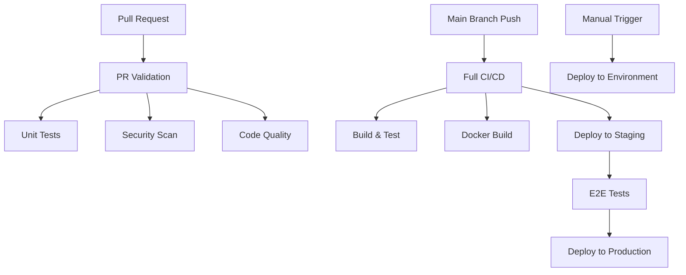

# GitHub Actions CI/CD Plan for Insurance AI POC

## 🎯 Overview

Modern, simple, and functional CI/CD pipeline using GitHub Actions with the following capabilities:
- **Docker builds** with multi-stage optimization
- **Kubernetes deployment** via Helm charts
- **Comprehensive testing** (unit, integration, E2E)
- **Automated PR reviews** and quality gates
- **Security scanning** and compliance checks

## 🏗️ Workflow Architecture



## 📁 Repository Structure

```
.github/
├── workflows/
│   ├── pr-validation.yml      # PR checks and reviews
│   ├── ci-cd-main.yml         # Main CI/CD pipeline  
│   ├── deploy-manual.yml      # Manual deployment
│   ├── security-scan.yml      # Security scanning
│   └── cleanup.yml            # Resource cleanup
├── actions/
│   ├── setup-k8s/            # Reusable K8s setup
│   ├── docker-build/         # Reusable Docker build
│   └── run-tests/            # Reusable test runner
└── dependabot.yml            # Dependency updates
```

## 🔧 GitHub Secrets Required

```yaml
# Docker Registry
DOCKER_REGISTRY: ghcr.io
DOCKER_USERNAME: ${{ github.actor }}
DOCKER_PASSWORD: ${{ secrets.GITHUB_TOKEN }}

# Kubernetes Contexts
KUBE_CONFIG_STAGING: <base64-encoded-kubeconfig>
KUBE_CONFIG_PRODUCTION: <base64-encoded-kubeconfig>

# API Keys (for testing)
OPENROUTER_API_KEY: <api-key>
OPENAI_API_KEY: <api-key>
LANGFUSE_SECRET_KEY: <secret-key>
LANGFUSE_PUBLIC_KEY: <public-key>

# Notification
SLACK_WEBHOOK_URL: <slack-webhook>
```

## 🚀 Workflow Implementations

### 1. PR Validation Workflow (`.github/workflows/pr-validation.yml`)

```yaml
name: 🔍 PR Validation

on:
  pull_request:
    branches: [ main, develop ]
    paths-ignore:
      - '**.md'
      - 'docs/**'

concurrency:
  group: ${{ github.workflow }}-${{ github.ref }}
  cancel-in-progress: true

jobs:
  changes:
    name: 📋 Detect Changes
    runs-on: ubuntu-latest
    outputs:
      code: ${{ steps.changes.outputs.code }}
      docker: ${{ steps.changes.outputs.docker }}
      k8s: ${{ steps.changes.outputs.k8s }}
    steps:
      - uses: actions/checkout@v4
      - uses: dorny/paths-filter@v2
        id: changes
        with:
          filters: |
            code:
              - 'src/**'
              - '*.py'
              - 'requirements.txt'
              - 'pyproject.toml'
            docker:
              - 'Dockerfile'
              - 'docker-compose.yml'
            k8s:
              - 'k8s/**'
              - 'helm/**'

  lint-and-format:
    name: 🧹 Code Quality
    runs-on: ubuntu-latest
    needs: changes
    if: needs.changes.outputs.code == 'true'
    steps:
      - uses: actions/checkout@v4
      - uses: actions/setup-python@v4
        with:
          python-version: '3.13'
          cache: 'pip'
      
      - name: Install dependencies
        run: |
          pip install black flake8 mypy pylint
          pip install -r requirements.txt
      
      - name: Black formatting check
        run: black --check --diff .
      
      - name: Flake8 linting
        run: flake8 . --count --select=E9,F63,F7,F82 --show-source --statistics
      
      - name: MyPy type checking
        run: mypy . --ignore-missing-imports
        continue-on-error: true

  unit-tests:
    name: 🧪 Unit Tests
    runs-on: ubuntu-latest
    needs: changes
    if: needs.changes.outputs.code == 'true'
    steps:
      - uses: actions/checkout@v4
      - uses: ./.github/actions/setup-python
      
      - name: Run unit tests
        run: |
          python -m pytest tests/unit/ -v --cov=. --cov-report=xml
      
      - name: Upload coverage to Codecov
        uses: codecov/codecov-action@v3
        with:
          file: ./coverage.xml
          flags: unittests
          name: codecov-umbrella

  security-scan:
    name: 🔒 Security Scan
    runs-on: ubuntu-latest
    needs: changes
    if: needs.changes.outputs.code == 'true'
    steps:
      - uses: actions/checkout@v4
      
      - name: Run Bandit security scan
        run: |
          pip install bandit
          bandit -r . -f json -o bandit-report.json
        continue-on-error: true
      
      - name: Run Safety check
        run: |
          pip install safety
          safety check --json --output safety-report.json
        continue-on-error: true

  docker-build-test:
    name: 🐳 Docker Build Test
    runs-on: ubuntu-latest
    needs: changes
    if: needs.changes.outputs.docker == 'true' || needs.changes.outputs.code == 'true'
    steps:
      - uses: actions/checkout@v4
      - uses: ./.github/actions/docker-build
        with:
          push: false
          tags: test-build

  pr-comment:
    name: 💬 PR Summary
    runs-on: ubuntu-latest
    needs: [lint-and-format, unit-tests, security-scan, docker-build-test]
    if: always()
    steps:
      - name: Comment PR
        uses: actions/github-script@v7
        with:
          script: |
            const results = {
              'lint-and-format': '${{ needs.lint-and-format.result }}',
              'unit-tests': '${{ needs.unit-tests.result }}',
              'security-scan': '${{ needs.security-scan.result }}',
              'docker-build-test': '${{ needs.docker-build-test.result }}'
            };
            
            const passed = Object.values(results).filter(r => r === 'success').length;
            const total = Object.keys(results).length;
            
            const body = `## 🔍 PR Validation Results
            
            ✅ **${passed}/${total} checks passed**
            
            ${Object.entries(results).map(([job, result]) => 
              `- ${result === 'success' ? '✅' : '❌'} ${job}: ${result}`
            ).join('\n')}
            
            ${passed === total ? '🎉 **Ready for review!**' : '⚠️ **Please fix failing checks**'}
            `;
            
            github.rest.issues.createComment({
              issue_number: context.issue.number,
              owner: context.repo.owner,
              repo: context.repo.repo,
              body: body
            });
```

### 2. Main CI/CD Pipeline (`.github/workflows/ci-cd-main.yml`)

```yaml
name: 🚀 CI/CD Pipeline

on:
  push:
    branches: [ main ]
  workflow_dispatch:
    inputs:
      environment:
        description: 'Deployment environment'
        required: true
        default: 'staging'
        type: choice
        options:
        - staging
        - production
      force_deploy:
        description: 'Force deployment even if tests fail'
        required: false
        default: false
        type: boolean

env:
  REGISTRY: ghcr.io
  IMAGE_NAME: ${{ github.repository }}

jobs:
  build-and-test:
    name: 🏗️ Build & Test
    runs-on: ubuntu-latest
    outputs:
      image-tag: ${{ steps.meta.outputs.tags }}
      image-digest: ${{ steps.build.outputs.digest }}
    steps:
      - uses: actions/checkout@v4
      
      - name: 🏷️ Extract metadata
        id: meta
        uses: docker/metadata-action@v5
        with:
          images: ${{ env.REGISTRY }}/${{ env.IMAGE_NAME }}
          tags: |
            type=ref,event=branch
            type=ref,event=pr
            type=sha,prefix={{branch}}-
            type=raw,value=latest,enable={{is_default_branch}}

      - name: 🧪 Run comprehensive tests
        uses: ./.github/actions/run-tests
        with:
          test-types: "unit,integration"
          
      - name: 🐳 Build and push Docker image
        uses: ./.github/actions/docker-build
        id: build
        with:
          push: true
          tags: ${{ steps.meta.outputs.tags }}
          labels: ${{ steps.meta.outputs.labels }}

  deploy-staging:
    name: 🚀 Deploy to Staging
    needs: build-and-test
    runs-on: ubuntu-latest
    environment: staging
    if: github.ref == 'refs/heads/main' || github.event.inputs.environment == 'staging'
    steps:
      - uses: actions/checkout@v4
      
      - name: 🔧 Setup Kubernetes
        uses: ./.github/actions/setup-k8s
        with:
          kubeconfig: ${{ secrets.KUBE_CONFIG_STAGING }}
          namespace: insurance-ai-staging
      
      - name: 📊 Deploy with Helm
        run: |
          helm upgrade --install insurance-ai-poc ./k8s/insurance-ai-poc \
            --namespace insurance-ai-staging \
            --create-namespace \
            --set image.repository=${{ env.REGISTRY }}/${{ env.IMAGE_NAME }} \
            --set image.tag=${{ needs.build-and-test.outputs.image-tag }} \
            --set environment=staging \
            --set secrets.openrouterApiKey="${{ secrets.OPENROUTER_API_KEY }}" \
            --set secrets.openaiApiKey="${{ secrets.OPENAI_API_KEY }}" \
            --wait --timeout=10m

  e2e-tests:
    name: 🎯 E2E Tests
    needs: [build-and-test, deploy-staging]
    runs-on: ubuntu-latest
    if: needs.deploy-staging.result == 'success'
    steps:
      - uses: actions/checkout@v4
      
      - name: 🔧 Setup Kubernetes
        uses: ./.github/actions/setup-k8s
        with:
          kubeconfig: ${{ secrets.KUBE_CONFIG_STAGING }}
          namespace: insurance-ai-staging
      
      - name: ⏳ Wait for deployment
        run: |
          kubectl wait --for=condition=ready pod \
            -l app.kubernetes.io/name=insurance-ai-poc \
            --timeout=300s \
            -n insurance-ai-staging
      
      - name: 🧪 Run E2E tests
        uses: ./.github/actions/run-tests
        with:
          test-types: "e2e,system"
          target-url: "http://staging.insurance-ai-poc.internal"

  deploy-production:
    name: 🚀 Production Deployment
    needs: [build-and-test, e2e-tests]
    runs-on: ubuntu-latest
    environment: production
    if: |
      (needs.e2e-tests.result == 'success' || github.event.inputs.force_deploy == 'true') &&
      (github.ref == 'refs/heads/main' || github.event.inputs.environment == 'production')
    steps:
      - uses: actions/checkout@v4
      
      - name: 🔧 Setup Kubernetes
        uses: ./.github/actions/setup-k8s
        with:
          kubeconfig: ${{ secrets.KUBE_CONFIG_PRODUCTION }}
          namespace: insurance-ai-production
      
      - name: 📊 Deploy with Helm
        run: |
          helm upgrade --install insurance-ai-poc ./k8s/insurance-ai-poc \
            --namespace insurance-ai-production \
            --create-namespace \
            --set image.repository=${{ env.REGISTRY }}/${{ env.IMAGE_NAME }} \
            --set image.tag=${{ needs.build-and-test.outputs.image-tag }} \
            --set environment=production \
            --set resources.requests.cpu=500m \
            --set resources.requests.memory=1Gi \
            --set resources.limits.cpu=2000m \
            --set resources.limits.memory=4Gi \
            --set autoscaling.enabled=true \
            --set secrets.openrouterApiKey="${{ secrets.OPENROUTER_API_KEY }}" \
            --set secrets.openaiApiKey="${{ secrets.OPENAI_API_KEY }}" \
            --wait --timeout=15m

  notify:
    name: 📢 Notify
    needs: [deploy-staging, deploy-production]
    runs-on: ubuntu-latest
    if: always()
    steps:
      - name: Slack notification
        uses: 8398a7/action-slack@v3
        with:
          status: ${{ job.status }}
          fields: repo,message,commit,author,action,eventName,ref,workflow
        env:
          SLACK_WEBHOOK_URL: ${{ secrets.SLACK_WEBHOOK_URL }}
```

### 3. Reusable Actions

#### Docker Build Action (`.github/actions/docker-build/action.yml`)

```yaml
name: 'Docker Build & Push'
description: 'Build and optionally push Docker images'

inputs:
  push:
    description: 'Push to registry'
    required: false
    default: 'true'
  tags:
    description: 'Image tags'
    required: true
  labels:
    description: 'Image labels'
    required: false
    default: ''

outputs:
  digest:
    description: 'Image digest'
    value: ${{ steps.build.outputs.digest }}

runs:
  using: 'composite'
  steps:
    - name: Set up Docker Buildx
      uses: docker/setup-buildx-action@v3
      
    - name: Log in to Container Registry
      if: inputs.push == 'true'
      uses: docker/login-action@v3
      with:
        registry: ${{ env.REGISTRY }}
        username: ${{ github.actor }}
        password: ${{ secrets.GITHUB_TOKEN }}
    
    - name: Build and push
      id: build
      uses: docker/build-push-action@v5
      with:
        context: .
        push: ${{ inputs.push }}
        tags: ${{ inputs.tags }}
        labels: ${{ inputs.labels }}
        cache-from: type=gha
        cache-to: type=gha,mode=max
        platforms: linux/amd64,linux/arm64
```

#### Test Runner Action (`.github/actions/run-tests/action.yml`)

```yaml
name: 'Run Tests'
description: 'Run comprehensive test suite'

inputs:
  test-types:
    description: 'Types of tests to run (unit,integration,e2e,system)'
    required: true
    default: 'unit'
  target-url:
    description: 'Target URL for E2E tests'
    required: false
    default: 'http://localhost'

runs:
  using: 'composite'
  steps:
    - name: Setup Python
      uses: actions/setup-python@v4
      with:
        python-version: '3.13'
        cache: 'pip'
    
    - name: Install dependencies
      shell: bash
      run: |
        pip install -r requirements.txt
        pip install pytest pytest-cov pytest-json-report
    
    - name: Run tests
      shell: bash
      run: |
        IFS=',' read -ra TYPES <<< "${{ inputs.test-types }}"
        for type in "${TYPES[@]}"; do
          echo "Running $type tests..."
          python -m pytest tests/$type/ -v \
            --json-report --json-report-file=test-results-$type.json \
            --cov=. --cov-append
        done
    
    - name: Upload test results
      uses: actions/upload-artifact@v3
      if: always()
      with:
        name: test-results
        path: test-results-*.json
```

#### Kubernetes Setup Action (`.github/actions/setup-k8s/action.yml`)

```yaml
name: 'Setup Kubernetes'
description: 'Setup kubectl and Helm for Kubernetes operations'

inputs:
  kubeconfig:
    description: 'Base64 encoded kubeconfig'
    required: true
  namespace:
    description: 'Kubernetes namespace'
    required: true

runs:
  using: 'composite'
  steps:
    - name: Setup kubectl
      uses: azure/setup-kubectl@v3
      with:
        version: 'v1.28.0'
    
    - name: Setup Helm
      uses: azure/setup-helm@v3
      with:
        version: '3.12.0'
    
    - name: Configure kubectl
      shell: bash
      run: |
        echo "${{ inputs.kubeconfig }}" | base64 -d > kubeconfig
        export KUBECONFIG=kubeconfig
        kubectl config use-context default
        kubectl create namespace ${{ inputs.namespace }} --dry-run=client -o yaml | kubectl apply -f -
        echo "KUBECONFIG=kubeconfig" >> $GITHUB_ENV
```

## 🔧 Helm Chart Enhancements

### Values Template (`.github/templates/values.staging.yml`)

```yaml
# Staging environment values
environment: staging

image:
  repository: ghcr.io/your-org/insurance-ai-poc
  tag: latest
  pullPolicy: Always

replicas: 1

resources:
  requests:
    cpu: 100m
    memory: 256Mi
  limits:
    cpu: 500m
    memory: 1Gi

autoscaling:
  enabled: false

ingress:
  enabled: true
  className: nginx
  annotations:
    cert-manager.io/cluster-issuer: letsencrypt-staging
  hosts:
    - host: staging.insurance-ai-poc.your-domain.com
      paths:
        - path: /
          pathType: Prefix
  tls:
    - secretName: staging-tls
      hosts:
        - staging.insurance-ai-poc.your-domain.com

monitoring:
  enabled: true
  serviceMonitor:
    enabled: true
```

## 📊 Quality Gates & Policies

### Branch Protection Rules

```yaml
# Repository settings -> Branches -> Add rule
Protection rules for 'main':
  - Require pull request reviews before merging
  - Require status checks to pass before merging:
    - lint-and-format
    - unit-tests
    - security-scan
    - docker-build-test
  - Require branches to be up to date before merging
  - Require conversation resolution before merging
  - Restrict pushes that create files larger than 100MB
```

### Environment Protection Rules

```yaml
# Settings -> Environments
Staging:
  - No protection rules
  - Deployment branch: main

Production:
  - Required reviewers: @team-leads
  - Wait timer: 5 minutes
  - Deployment branch: main only
```

## 🔒 Security Best Practices

### 1. Secret Management
- Use GitHub Secrets for sensitive data
- Rotate secrets regularly
- Use environment-specific secrets

### 2. Image Security
- Multi-stage Docker builds
- Scan images for vulnerabilities
- Use minimal base images
- Sign container images

### 3. Kubernetes Security
- Network policies
- Pod security standards
- Resource limits
- RBAC configuration

## 📈 Monitoring & Observability

### 1. Deployment Metrics
- Deployment frequency
- Lead time for changes
- Mean time to recovery
- Change failure rate

### 2. Application Metrics
- Response times
- Error rates
- Throughput
- Resource utilization

### 3. Pipeline Metrics
- Build success rate
- Test coverage
- Security scan results
- Pipeline duration

## 🚀 Getting Started

1. **Setup Repository Secrets**
   ```bash
   # Add required secrets in GitHub Settings -> Secrets
   ```

2. **Configure Environments**
   ```bash
   # Create staging and production environments
   ```

3. **Update Helm Charts**
   ```bash
   # Ensure values.yaml supports CI/CD variables
   ```

4. **Test Pipeline**
   ```bash
   # Create a test PR to validate workflows
   ```

## 🔄 Maintenance

### Weekly Tasks
- Review failed pipelines
- Update dependencies
- Check security vulnerabilities
- Monitor resource usage

### Monthly Tasks
- Review and update workflows
- Optimize build times
- Clean up old artifacts
- Update documentation

This plan provides a modern, secure, and maintainable CI/CD pipeline that scales with your team and ensures high-quality deployments. 